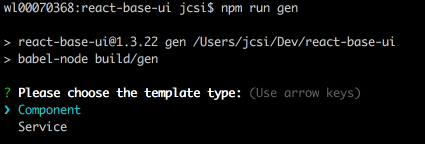
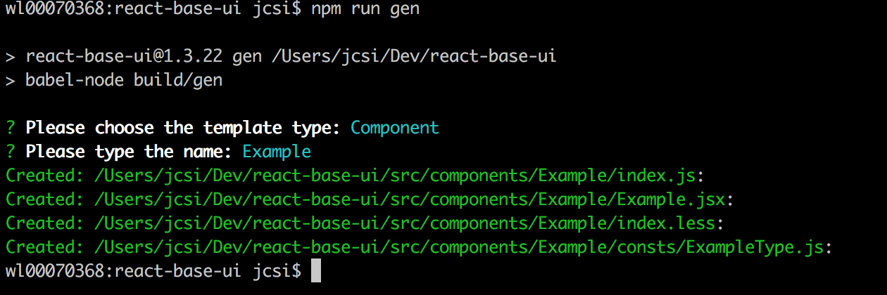

# UI Component Development Template

### This document describes the standard and template for defining UI Component in react-base-ui.

All UI Components should follow the same requisites with exactly same pattern, which is important for development, maintainance and integration.

Basically, some of the rules are specially defined for JSDoc purpose.

## Name
- The name of UI Component should be in CamelCase. 
  
  For example: Button, Input, InputNumeric


## File Structure
- Files of a UI Component are stored under folder src/components/{ComponentName}.
- UI Component class is defined in file with the same name to ComponentName.

  Please don't define UI Component class in index.jsx
- Folder of that UI Component must has an index.js which defines exportable stuff
- Constants or Enum are defines under sub-folder 'consts'

## Enum Definition
- Defines Enum in Object style (for JSDoc purpose)
- Write JSDoc for Enum

> example code:
```javascript
/** Button Type
 * @enum {string}
 * @memberof Button
*/
const ButtonType = {
  PRIMARY: 'primary',
  SECONDARY: 'secondary',
  STRONG: 'strong'
};
```

## UI Component Class

The main class of an UI Component follows the same below format pattern.

- Use 'extends' to define Component Class (for JSDoc purpose)
- Defines Component Class as const (for JSDoc purpose)
- Component Class must have static members of
  - **displayName**
  - **defaultProps**
  - **propTypes**
- Defines PropTypes out side the class with name {ComponentName}PropType (for JSDoc purpose)
- Write JSDoc for Component Class
- Write JSDoc for all the prop types


> example code:

```javascript
/** Default PropTypes of Button.
 * @memberof Button
*/
const ButtonPropTypes = {
  /** Determines whether the button is a not a Submit button.
   * @type {boolean}
  */
  noSubmit: bool,
  /** Whether or not to show loading icon.
   * @type {boolean}
  */
  loading: bool,
  /** Determines the button type.
   * @type {Button.ButtonType}
  */
  type: string,
  /** Determines the button size.
   * @type {Size}
   */
  size: string,
  /** Custom class name.
   * @type {string}
  */
  className: string,
  /** Child Node
   * @type {node}
  */
  children: node
};
class Button extends React.PureComponent {
  static displayName = 'Button';
  static defaultProps = ButtonProps;
  static propTypes = ButtonPropTypes;

  render(){}
};

export default Button;
```

## Creating UI Component from CLI

react-base-ui suports creating UI Component from CLI, this is a quick way to creating UI Component files in the correct folder.

```javascript
> npm run gen
```

- Running the above npm command, you will be asked to create Component or Service. - Select Component, then type in the Component Name, a minimal set of files will be created automatically for you in folder src/components/{ComponentName}.
- You can continue your work base on this start up.

> Step1:




> Step2:

