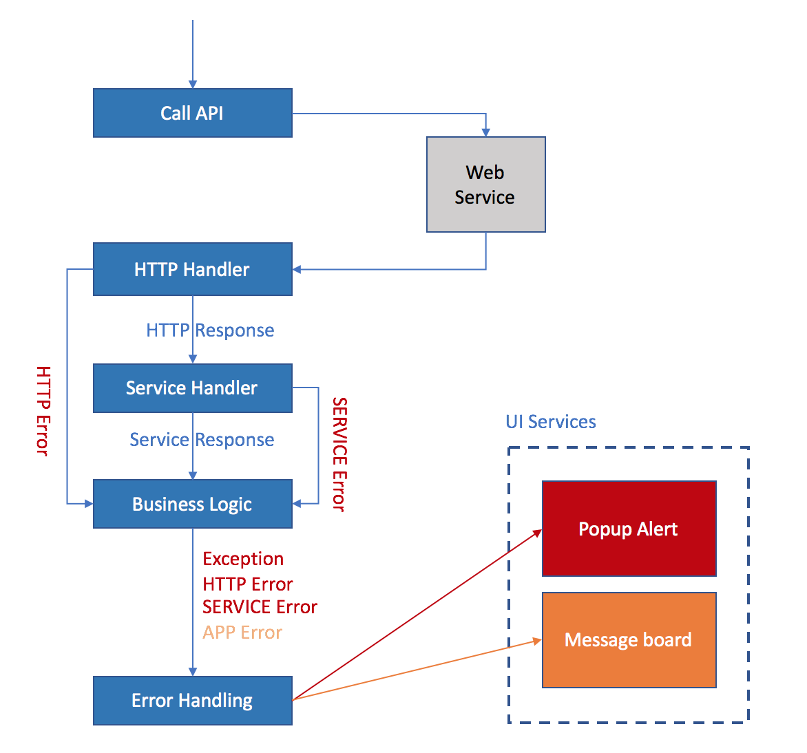
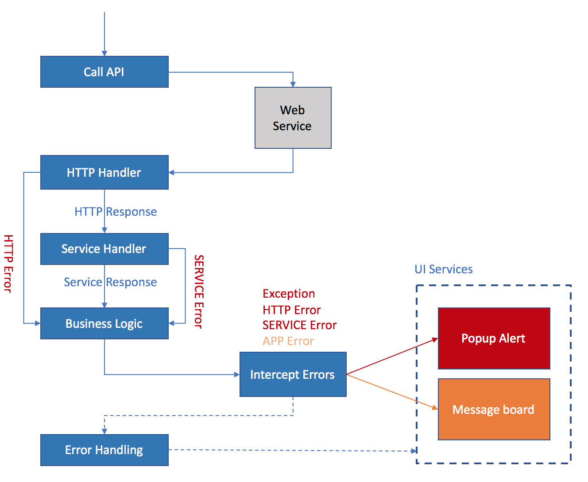

# Error Handling Mechanism


## Error Types

There are 4 types of Error we can see in front end projects.

- EXCEPTION

Any Exceptions been thrown during the computing progress, for example, EvalError, TypeError.

- HTTP

Error responsed by HTTP Server. For example, 404 Not Found. 500 Internal Server Error.

- SERVICE

Error responsed by REST Service. For example, '0002' Session Time Out. '9999' Unknown Error.

We have rules on Server side on defining the error codes, and errors are divided into 2 categorie: System Error and Businiss Error.

 > System Error Code = 0002 ~ 0999 || 9999

 > Business Error Code >= 1000 exclude 9999

Error handling mechanism doesn't care about the System or Business error code definition, we leave the identification on error code to developer.

- APP

Any business level error. For example, input field validation error, confliction error while data submitting etc.

EXCEPTION, HTTP, SERVICE errors are show stoppers that may affect the normal process, error information will be popup in a modal dialog box. 

APP errors are displayed in message board (top area of the page with alert color).


## Error Object

ErrorObj class is used to wrapp consistent error information across the application. 

The ErrorObj class has 3 members:

- type

Error type defined above. Default value is ErrorTypes.APP

- message

Text or Object that represents the message information.
If it is an object, the structure is same as that used to display information in notification service.

- data (optional)

Additional information, may variant to differrent Error type.
For example, for HTTP Error, the data stores HTTP status code and requested url.
For SERVICE error, the data stores response code and requested resource's url.

You can import the ErrorObj class and ErrorTypes enum from base ui, for example:

```javascript
import { ErrorObj, ErrorTypes } from 'react-base-ui'

const err = new ErrorObj(ErrorTypes.APP, 'The input value XYZ is incorrect.');
```

## Reporting Error

API layer will report HTTP Error and SERVICE Error automatically.

For business logic, you are allowed to report any sort of error, but we encourage you reporting APP error only. Other types of error don't make sence.

To report an error, you need to compose an error object, and then dispatch it, like below:

```javascript
import { Actions, ErrorObj, ErrorTypes } from 'react-base-ui';

export const someAction = () => (dispatch) => {
  //......
  const err = new ErrorObj(ErrorTypes.APP, 'Error message goes here....');
  dispatch(Actions.reportError(err));
  //......
}

```


## Error Handling Work Flow

Error may happen during requesting RESTful API, or when handling business logics which compose the application.

EXCEPTION, HTTP, SERVICE are reported by the API layer automatically.

By default, we have built-in error handling mechanism to handle the reported errors. The working flow looks like below:



Business logic can also intercept errors reported by API, do its own handling before passing to the built-in error handling routine.
Or, it can event swallow the errors, without passing them to further handling. Like below picture shows:



Let's describe variant scenarios by some code examples:

> Below example does not handle any errors, but let the built-in handling routine to handle them.

```javascript
import API from '../api';

export const fetchShoppingCartCountAction = () => (dispatch) => {
  return API.getCartCount().then((response) => {
    const { cartCount } = response.body;
    dispatch(updateShoppingCart(cartCount));
  });
};
```

> Below example reports an APP error in business logic. Meanwhile, API errors are passed to the built-in error handling.

```javascript
import { Actions, ErrorObj, ErrorTypes } from 'react-base-ui';
import API from '../api';

export const fetchShoppingCartCountAction = () => (dispatch) => {
  return API.getCartCount().then((response) => {
    if (response.body.errors.length > 0){
      const err = new ErrorObj(ErrorTypes.APP, 'Error happen when fetching shopping cart');
      dispatch(Actions.reportError(err));
    }else{
      const { cartCount } = response.body;
      dispatch(updateShoppingCart(cartCount));
    }
  });
};
```

> Below example demonstrates how to intercept the errors in business logic.

```javascript
import { Actions, ErrorObj, ErrorTypes } from 'react-base-ui';
import API from '../api';

export const fetchShoppingCartCountAction = () => (dispatch) => {
  return API.getCartCount().then((response) => {
    const { cartCount } = response.body;
    dispatch(updateShoppingCart(cartCount));
  }).catch(error => {
    // Your private error handling logic goes here....
    // Bla bla bla ....

    // If you want the built-in error handling still handle the error, just uncomment below line
    // return Promise.reject(error);
  });
};
```

#Enjoy

