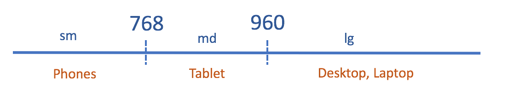
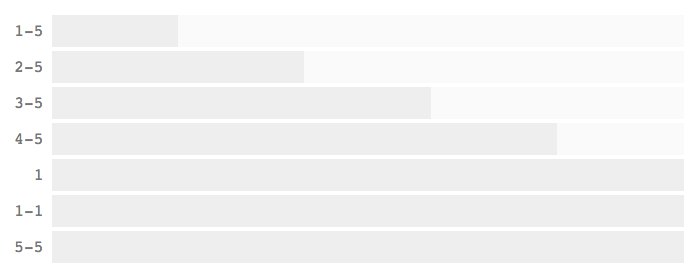

# ANET CUI Responsive Development Guidelines

This document describes the requirments, targets and guidlines that developers need to know when developing the responsive web page for CUI.

You can find below helps from this documentation:
- What type of devices should be supported
- What are the breakpoints of view ports
- Where I can find the UI design documents
- How to use media query in my LESS files
- How to name my CSS classes
- How to use the predefined Grid Layout System

### Background
----
ActiveNet customer portal (CUI) is the end point portal used by customers of the tenants (AUI users). It has much more wide of user groups, more types of client devices, with more flexible access demonds than AUI. 

Due to this background, CUI was required to support responsive layout so that users can access it from differrent type of devices without problem.

### HTML Mobile Application Only
----
Please notice that developing Native or Hybrid Mobile Application is not in our concern scope.

What we are going to cover is only the concept of HTML Mobile Application, that means will allow user to access the CUI from browsers without problem, and the UX is good.

### Vertical Scrolling Only
----
To provide better UX, in any cases, horizontal scrolling should not appear in page level container. Content of application will always be "flexed" vertically.

This is an important design principle in most of the Mobile First strategy today, we need to follow it as well.

### Supported Devices
----
Customers should be able to access CUI from below devices (with browsers):
- Desktop
- Laptop
- Tablet
- Smart Phone

### UI Design Document
----
You can the design documents via [UI Design](https://zpl.io/Z14Kpg1 "UI Design")

You can access Zeplin from web or install a Zeplin Application and open the design document in that application.

### Words of Sizes
----
We use consistent abbreviations to represent sizes in AN's responsive CSS system. You can and can only use below words, and in any cases when you see the abbreviations, you would know they are representing sizes.

Below 5 abbreviations are used to represents size:

- xs = Extra Small
- sm = Small
- md = Medum
- lg = Larg
- xl = Extra Large

> **Note:**
Only sm, md and lg are used to represents viewport sizes in responsive class names. We will talk this in following section.


### Viewport Breakpoints
----
CUI utilizes media queries to create **width** sensitive layout and interfaces. 

Much simpler comparing to Bootstrap, thera are **only 3** sections of width ranges with 2 breakpoints defined, they are:

- sm: < 768px  (For Smart Phone)
- md: >=768 & < 960 (For Tablet)
- lg: >=960px (For Laptop or Desktop)



Please notice:
- **Only** 3 viewport sizes are defined: sm, md and lg
- Screen width >= 960 keeps the same layout, we don't have special handling for extra large screen(>1200px)
- 960px is used for large breakpoint, instead of 992px in Bootstrap

Rather than writing out the media queries every time, we’ll use a media-queries.less file with media query variables. 

As a result, 3 media queries will be defined in LESS variables, they are:
- @media-query-small
- @media-query-medium
- @media-query-large

If print media is supported, we will define @print as well.

In case you need to define your own CSS classes for particular viewport, you can use those predefined queries,
for example:

```css
@import "../variables/media_query.less";

// define class for variant breakpoints
@media @small{
  .an-sm-header{...}
}

@media @medium{
  .an-md-header{...}
}

// define styles for variant breakpoints
.an-table{
  @media @small{
    thead {
      display: none;
    }
  }
}


```

### Syntax for CSS Class Names
----
CSS class names follow the below syntax:

> **Syntax:**
>
> [namespace-][viewportSize-]\<name\>[__childName][.variation]

Where

[namespace] = an  
[viewportSize] = sm|md|lg  
[name] = component name or general name  
[childName] = child element name  
[variation] = state or modifier  
  
We use namespace "an" to avoid collisions of CSS between our own with other library.

We use [BEM](https://csswizardry.com/2013/01/mindbemding-getting-your-head-round-bem-syntax/) as our naming methodology for the components.

One exception we don't follow BEM is we are going to use state/modifier class to decorate class. 

State class starts with **.is-**, while modifier class starts with **.mod-**. This is similar to **ui-state-** defined in jQuery UI.

State classes show that something is enabled, expanded, hidden, or what have you. For these classes, we’ll use .xxx.is-state pattern.

Modifier classes has the similar pattern with state classes, we will use .xxx.mod-modifier patter. There is no strict line seperating what should be state, what should be modifier.

Generally, we consider below as states:
> **State examples:**
default, hover, focus, active, highlight, error, disabled, primary, secondary

We consider below as modifier: 
> **Modifier examples:**
sign-up, coach-point, tips, see-more

Here is an example:

```css
.an-footer-button {
  height: 40px;
  width: 200px;
}

.an-footer-button.is-active {
  font-weight: bold;
  color: red;
}

<div class="an-footer">
  <span class="an-footer-button is-active">
    Label
  </span>
  <span class="an-footer-button">
    Label
  </span>
</div>

```


We also have some practical rules for component names, which would be helpful to produce consistent coding style and make the code readable and easier to maintain. They are:

- Names are in lowercase
  
  There are browser problems with case sensitivity, so you're safe always lowercasing.
  So, names like 'Grid', 'Grid_col' are bad.
- Use meaningful words for component names

  Abbreviations are not encouraged, they are easier to type but hard to maintain.
- Use dash (-) as a separator
- Avoid presentation-specific words, for example: text-blue, light-box etc.

---

> **CSS names examples:**

```javascript

.an-input-date {...}
.an-input-date__field {...}
.an-input-date--focus {...}

// hide in small viewport
.an-sm-sidebar {
  display:none;
}

```

> **Note:** There are some special cases that use abbreviations in pre-defined system classes. For example, an-u-* represents
utilities, an-t-* represents theme, an-js-* represents the DOM has js behaviors associated.

### Grid Layout System
----
Grid Layout System used in ANet is simple but still powerful, the system is composed by a grid grid container and one or more columns that split the available width in container.

Facts:
- The grid layout system is composed by an-grid and an-col or an-col-* classes.
- All child elements of an-grid must be an-col or an-col-*
- Contents go inside an-col or an-col-*
- Grid can be nested inside another grid
- The widths of columns are fractions, for example, an-col-1-2 represents 50% in width, an-col-1-5 represents 20% in width.
- We have 24 columns in maximum

> **Syntax of column classes:**
> 
> [namespace-][viewportSize-]col[-fraction]


Where

[namespace] = an  
[viewportSize] = sm|md|lg  
[fraction] = n|i-n  

For examples:  
- an-col: General column classes, used to define the alignment etc.
- an-col-1: 100% width (1/1)
- an-col-2: 50% width (1/2)
- an-col-5: 20% (1/5)
- an-col-3-8: 37.5% (3/8)
- an-col-4-8: 50% (4/8)
- an-sm-col-3: 33.333% (1/3, only applied in small viewport)
- an-sm-col-4-8: 50% (4/8, only applied in small viewport)

**An example of 5th grid**  


The Grid Layout System we choose is a simple one comparing to Bootstrap, If you have special requirements, please let us know, we may improve it in service level.
