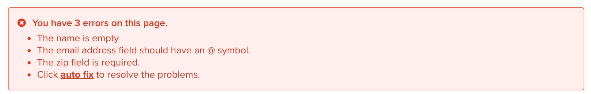
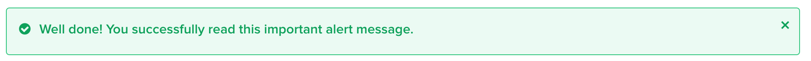

# UI Services

UI service is a sort of concept that providing assistant or decorative functionalities to your front end application,
without depending on the rendering and state management of React.

That means, in some cases, developers don't need to define the UI element, don't need to manage the state for this global UI.
This for sure will simplify the workload, and fasten the development, and minimize the size of DOM.

### So, what will be UI services? 

The most common seen features of UI services are:
- Popup or temparary used UI assistants
- Globally UI that should not be cared by the business UI components
- Buddy decorations

Some examples I can see are:
- Confirmation
- Notifications
- Date/time picker
- Tooltips
- Input validators

## Confirmation Service

A service function that can pop up a confirmation dialog box, accept user's choice and allow developer to continue the business logic
according to user's input.

The return value is a Promise from where you can process the task when OK is clicked, or just ignore if Cancel is clicked or the dialog
is dismissed.

By default, only the 'OK' button is displayed, with default label 'OK'.
You can change the visibility of the 'Cancel' button and change the button labels by setting the options.

Example:
```javascript
import { UIServices } from 'react-base-ui';

UIServices.confirm('Are you sure you want to delete the booking item?', {showCancel: true}).then(
  () => { // Do deleting operation here...}
);;

```

The accepted options are:
- title

  The title of the dialog box. Default value is 'Confirm'
- message

  The message text displayed as body
- showCancel

  Determines the visibility of the Cancel button. Default value is false.
- cancelText

  The label of Cancel button. Defaut value is 'Cancel'
- confirmText

  The label of OK button. Default value is 'OK'


Example to change the confirm text:
```javascript
import { UIServices } from 'react-base-ui';

UIServices.confirm('UI session time out, please click the Reload button to refresh the page', {confirmText: 'Reload'}).then(
  () => { // Do page reloading operation here...}
);;

```

The error handling mechanism is using the confirmation service to display API response error. 


## Notification Service

Notification service are series of functions that can help displaying/hiding instant information in a web application.

You don't need to define the DOM/actions/reducers to handle the displaying of the information on each page,
what you need to do is as simple as telling the Notification service *'Hey, I have something to let the end user know!'*.

Notification service handles all the work for you.
This is also a key method to make sure we have consistent notifications look and feel across the application.


There 4 types of information style you can choose:

- Success
- Info
- Warning
- Error

The appearance of each are defined in [Active.CSS]('http://css/container/alert/)

To use Notification service, you have 3 steps to take:
1. Import UIService and MessageBoard from react-base-ui.

2. Place a MessageBoard component to your page.
  MessageBoard is the container where notification messages are displayed.

3. Call notification helper functions.


Below are some examples:

### Basic usage

Notification service supports displaying simple text as below.

Example:
```javascript
import { UIServices, MessageBoard } from 'react-base-ui';

UIServices.success('Well done! You successfully read this important alert message.');
//or
UIServices.info('Heads up! This alert needs your attention, but it\'s not super important.');
//or
UIServices.warning('Warning! Better check yourself, you\'re not looking too good.');
//or
UIServices.error('Oh snap! Change a few things up and try submitting again.');

```
 

### Rich information with multiple lines

Notification service supports displaying message with title and details in multiple lines. Which can be seen in [Active.CSS]('http://css/container/alert/)

Example:
```javascript
import { UIServices, MessageBoard } from 'react-base-ui';

const message = {
  title: 'You have 3 errors on this page.',
  details: [
    'The name is empty',
    'The email address field should have an @ symbol.',
    'The ZIP field should have at least 5 numbers.'
  ]
};

UIServices.error(message);
```

### Customized detail

You can also define your customized detail if text can't meet your requirement.

For example, sometimes you may need to define a line that contains button or clickable text from where the end user can invoke a business action.

Example:

```javascript
import { UIServices, MessageBoard } from 'react-base-ui';

doFix(){
  //....
}

const message = {
  title: 'You have 3 errors on this page.',
  details: [
    'The name is empty',
    'The email address field should have an @ symbol.',
    'The ZIP field should have at least 5 numbers.'
  ]
};

const link = (<span>Click <a onClick={doFix()}>auto fix</a> to resolve the problems.</span>);
message.details.push(link);

UIServices.error(message);
```
The reault looks as below:



### Co-exist of multiple informations

Notification service supports configuration options, from where you can change the behaviors of the information displaying.

For example, multiple informations are allowed to eixst side by side. To do this, just set the 'autoClean' option to false.
(By default, it is true)

Example:

```javascript
import { UIServices, MessageBoard } from 'react-base-ui';

UIServices.success('Well done! You successfully read this important alert message.', { autoClean: false });
UIServices.info('Heads up! This alert needs your attention, but it\'s not super important.', { autoClean: false });
UIServices.warning('Warning! Better check yourself, you\'re not looking too good.', { autoClean: false });

```
The result looks as below:


To clean the message board manually, call the clean method.

Example:

```javascript
import { UIServices, MessageBoard } from 'react-base-ui';

UIServices.clean();

```

To clean only a type of messages, supply parameter 'type' when calling the clean method.


Example:

```javascript
import { UIServices, MessageBoard } from 'react-base-ui';

UIServices.clean(UIServices.MessageTypes.ERROR);

```

### Dismissable information

Notification service support displaying dismissable information with a close button on it.
User can close the information manually if he/she wants. This is useful if the information a general one or not serious.

To do it, you can pass another configuration option 'dismissable' to the notification methods with value set to true.

Example:
```javascript
import { UIServices, MessageBoard } from 'react-base-ui';

UIServices.success('Well done! You successfully read this important alert message.', { dismissable: true });
```

The result looks as below:



# Enjoy!
