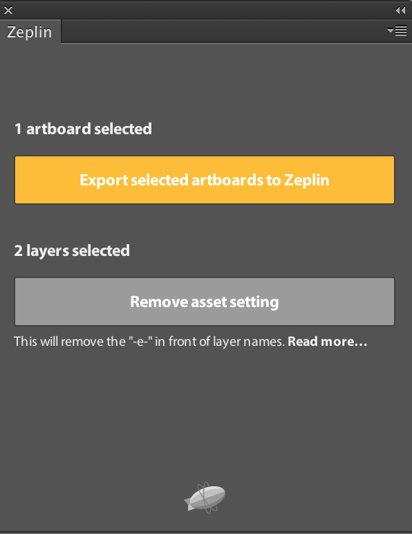

# zeplin

* import assets from PS
1. choose all layers , right click <kbd>from artboard</kbd>
2. window -> extension -> zeplin 
3. choose all assets within previous artboard -> mark as assets
4. export to zeplin, see below:

