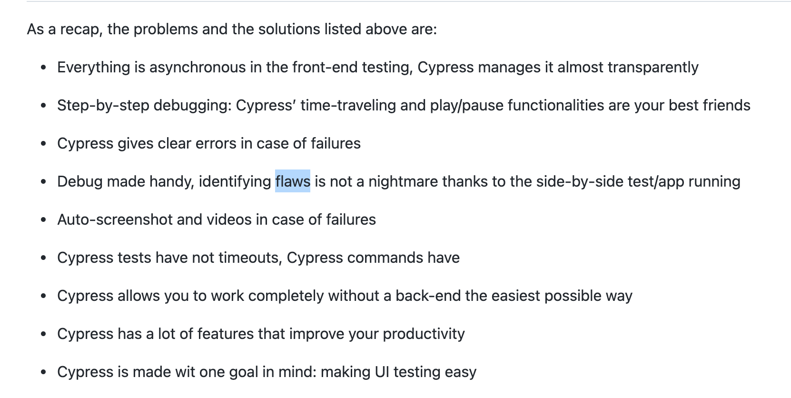

# 测试相关总结

## enzyme

	- shallow(shallow<ele>) 只在虚拟dom中渲染第一层（不是第一层节点，而是第一个组件）,不渲染子组件（未使用嵌套组件的情况下），大部分情况下应该使用这种
  - shallow中有个API (dive()),只能用在非dom的元素上，比如包装了多层最后default导出的component,就可以直接使用default的然后在其上使用dive()方法，如果包裹多层就使用多次。
	- full (mount<ele>)加载到真实dom,当需要测试liftcycle,或者使用了自定的嵌套组件， 和有DOM交互的地方使用
	- static(render<ele>) 渲染成html字符，和shallow区别在于使用了第三方库，一般不常用，和shallow功能一样

    ```
     shallow/mount区别 
      class CommentList extends Component {
        render() {
          return (
            <ul>
              <li> Comment One </li>
            </ul>
          )
        }
      }

     class Root extends Component {
       render() {
         return (     
           <div style={styles}>
             <h1 className='welcome-header'>Welcome to testing React!</h1>
             <CommentList/>
             <h1 className='welcome-header'>Welcome to testing React!</h1>
           </div>
         )
       }
     }
     ////
     const mountWrapper = mount(<Root />);
     const shallowWrapper = shallow(<Root />);

     mountWrapper 会把所有的渲染，
     shallowWrapper 只会在内存中渲染Root组件，不会渲染其中的CommonList组件，如果调试输出:
     
     shallowWrapper.text() = "Welcome to testing React!<CommentList />Welcome to testing React!"//没有渲染CommnetList

     shallowWrapper.html() = "<div style="height:100%;background:#333;"><h1 class="welcome-header">Welcome to testing React!</h1><ul><li> Comment One </li></ul><h1 class="welcome-header">Welcome to testing React!</h1></div>"
     //这里注意html（）虽然是最终渲染的结果，但并不是说shallow会进行最终渲染，只是html（）这个方法会最终渲染所有的，一定注意区别

     mountWrapper.text() = "Welcome to testing React! Comment One Welcome to testing React!" // 渲染了CommentList

     mountWrapper.html() = "<div style="height: 100%; background: rgb(51, 51, 51);"><h1 class="welcome-header">Welcome to testing React!</h1><ul><li> Comment One </li></ul><h1 class="welcome-header">Welcome to testing React!</h1></div>"

    ```
  1. simulate（‘xx’，{target:{value:text}}）,事件统一没有on前缀，直接是事件名，第二个事件参数是一个模拟对象会和event对象合并到一起传入到事件当中,如：

    ```
      <input click={(e)=>{testFunc(e.target.value)}}/>
      input.simulate('click',{target:{value:123}});
      //用到了哪个属性就模拟哪个属性
    ```
    ***重要***
    模拟非标准dom事件，即自定义事件时，不用找到内部的标准事件去模拟，直接使用wrapper.find(xx).prop('customEvent')(fakeEvent)//注意不是props,后者是props.customEvent
    [看这个](https://github.com/airbnb/enzyme/issues/147)
    demo
    ```
    <CheckScrollModal
            onScrollToBottom={() => {
              this.props.hideWarningAlertAction();
            }}

    it.only('should trigger modal close correctly', () => {
      const { component, checkScrollModal, actions } = setup();
      <!--checkScrollModal.prop('onScrollToBottom')(() => {
        return actions.hideWarningAlertAction;//函数体内任意代码，只要有模拟的方法就行，默认的那个action就会被执行，很奇怪
      });-->
      checkScrollModal.prop('onScrollToBottom')();//什么都不写也可以执行
      expect(actions.hideWarningAlertAction).toHaveBeenCalled();//这样就可以了
    });
    //jest 测试写法
      const _ins = component.instance();
      const spy = jest.spyOn(_ins, 'handleClick');
      xxx.prop('ShowDeleteTransactionAlert')(2);
      expect(spy).toHaveBeenCalledWith(2);
    ```
  2. 测试组件内部方法或属性，使用component.instance()
    ```
     class A extends React.component{
       handleClick(){
         xxxx
       }
       componentDidMount(){
         xxx
       }
     }
     // 内部方法测试
      const { component } = setup();
      const _ins = component.instance();
      const spy = expect.spyOn(_ins,'handleClick');//这样就能spy上
      //_ins.handleClick()就可以访问到
      
      ...
      // 生命周期测试
     //  需要注意的是一定要在组件中声明的方法或者生命周期方法才可以测试
     const spy = expect.spyOn(_ins,'componentDidMount');//这样就能spy上

    ```
## React tesing library(RTL)

> RTL从**用户使用角度**帮助测试**UI组件**的**一组**包

几点原则需要注意：

  - RTL vs Enzyme [参考](https://betterprogramming.pub/react-enzyme-vs-react-testing-library-2cac3ad20c52?gi=6a69568c4e6d)
  - 不关注实现细节，只关注用户交互

  - 避免以下实现细节

    1. 组件内部状态
    2. 组件内部方法
    3. 组件生命周期
    4. 子组件

  - get/query/find 

  ```js
  import {screen, getByLabelText} from '@testing-library/dom'

  // With screen:
  const inputNode1 = screen.getByLabelText('Username')

  // Without screen, you need to provide a container:
  const container = document.querySelector('#app')
  const inputNode2 = getByLabelText(container, 'Username')
  ```
  当get/query/find 选择不到目标节点的时候 推荐使用data-testId 属性
  
  -priority

    1. getByRole
    2. getByLabelText
    3. getByPlaceholderText
    4. getByText // 应用于非输入性组件
    5. getByDisplayValue // 应用于表单输入组件
    6. getByAltText
    7. getByTitle
    8. getByTestId

  - debug

    ```js
      screen.debug();
      screen.debug(screen.getByText('test));
      screen.debug(screen.getAllByText('test));
    ```
    or

    ```js
      console.log(prettyDOM())
    ```
    
    logRoles();
    
    ```js
    import {getRoles} from '@testing-library/dom'

        const nav = document.createElement('nav')
        nav.innerHTML = `
        <ul>
          <li>Item 1</li>
          <li>Item 2</li>
        </ul>`
        console.log(getRoles(nav))

        // Object {
        //   navigation: [<nav />],
        //   list: [<ul />],
        //   listitem: [<li />, <li />]
        // }
    ```


  > Q: RTL 不关注实现细节，那组件中的实现相关的覆盖率如何保证？

  > A: Any complex logic shouldn’t be living in the components, and that’s why the React Testing Library doesn’t focus on testing at that level. Business logic should be decoupled from the component. By doing so, you can unit-test it using only Jest.

  > 这段话很好解释了测试的原则，组件中不应包含复杂的逻辑，任何的业务逻辑应该从组件中解耦出来，然后进行单独的单元测试，这时候只用jest就可以了

  - 快照测试

  本意是好的（提醒开发者注意组件的变化），但执行时因为代码的更改会频繁的导致快照失败，开发者只是简单的更新快照使其pass而已，在code review的时候也很难去发现变化，所以并不建议使用


## Jest

  - Snapshot 

    快照测试不仅能用于ui组件的dom，它能用来测试一切js对象，所以可以应用到API的快照测试上。
    
    ```js
      it('will check the matchers and pass', () => {
      const user = {
        createdAt: new Date(),
        id: Math.floor(Math.random() * 20),
        name: 'LeBron James',
      };

      expect(user).toMatchSnapshot({
        createdAt: expect.any(Date),
        id: expect.any(Number),
      });
    });

    // Snapshot
    exports[`will check the matchers and pass 1`] = `
    Object {
      "createdAt": Any<Date>,
      "id": Any<Number>,
      "name": "LeBron James",
    }
    `;
    ```

  API 快照demo

  ```js
  import * as API from 'api';

  test('failed login (bad password)', async () => {
    let data;
    try {
      data = await API.login('me@example.com', 'wrong_password');
      fail();
    } catch(e) {
      expect(e.response.data.error).toMatchSnapshot();
    }
  });
  ```
## 易错
1. 测试Error时，该对象是特殊的对象，比如error= new Error（‘ttt’）,如果直接输出console.log(error)，并不会打印出error对象而是打印出error.toString()的相关信息

## E2E Test


阅读[UI-testing-best-practices](https://github.com/NoriSte/ui-testing-best-practices)

> Puppeteer vs Cypress

简单总结： Puppeteer是浏览器自动化处理工具并不是专门的UI测试工具，所以很多特点功能如:

  - skip/only
  - 超时设置
  - 截图
  - 当前测试case状态
  - 调试
  - 序列运行

等都需要额外的设置或其他工具辅助，不如cypress来的高效直接和简单。

  - cypress优势总结

    

如果只是用来抓取数据或其他自动化浏览器操作的 cypress并不是最好的选择，它只是用于UI测试