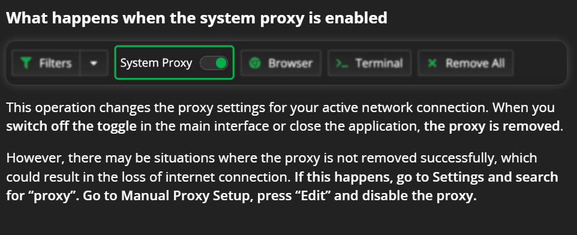
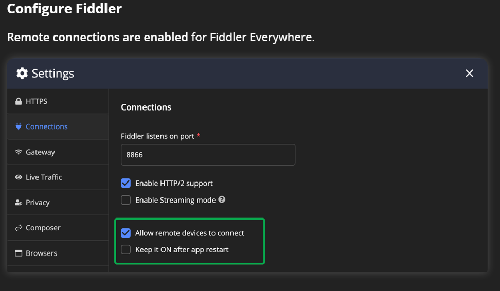

# Fiddler抓包流程

## 抓PC段

前提安装根证书，并信任。

1. 启用系统代理，， 这样会捕获所有电脑上的请求。

## 抓移动端

1. 设置 
2. 手机访问 http://198.18.0.1:8866 安装根证书并信任， 注意IP是系统网卡的ip不是clash客户端的
3. 手机端配置代理，ip:8866, ip同样是系统网卡ip不是clash客户端的
4. **手机关闭vpn** 
